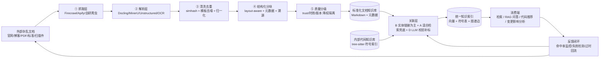

# 代码知识库 × 外部文档知识关联：综合调研与方案总结

> **调研背景**：企业已有内部代码知识库（代码检索/索引系统、代码向量库、Sourcegraph 类工具），需要将**外部杂乱文档知识**（API 文档、技术博客、标准规范 PDF、白皮书、厂商文档）与代码知识库建立关联。
>
> **核心痛点**（用户明确提出两点）：
> 1. **外部知识杂乱，需要治理**——来源杂、格式杂、质量杂
> 2. **如何关联**——把治理后的文档与代码实体建立可持续的映射
>
> **方法**：三路并行调研（工具平台 / 学术论文 / 治理+关联方法论），从全部调研材料出发，综合提炼为最完善的落地方案。

---

## 一、调研材料速览

### 1.1 工具与平台（22 项，覆盖 30+ 工具）

| 类别 | 代表工具 | 关键结论 |
|---|---|---|
| 代码知识平台 | Sourcegraph、Cody、Copilot Enterprise、CodeQL、Augment Code、Continue、Cursor | **无现成的"代码-文档关联"完整产品**；Sourcegraph Notebooks 曾支持、Copilot KB 仅接受 Markdown |
| RAG / 向量库 | Milvus、Qdrant、pgvector、Weaviate、Chroma、LlamaIndex、LangChain、Dify、FastGPT、RAGFlow | **混合检索（dense+sparse）是代码(符号)↔文档(自然语言)异构检索的关键**；RAGFlow 文档治理最强（DeepDoc） |
| 代码检索/语义 | Aider repo-map、grep.app、tree-sitter、CodeBERT/UniXcoder | tree-sitter 是代码结构化分块的底座；代码嵌入模型是"代码↔文档同向量空间"的核心 |
| 文档治理 | Firecrawl、Apify、Docling、Unstructured、MinerU、OpenMetadata | **Docling（⭐6.6万）+ MinerU（⭐7.9万）+ Firecrawl（⭐17.4万）组合是治理侧最强** |

### 1.2 学术论文（15 篇，均经 arXiv API 验证）

| 主题 | 代表论文 | 核心启示 |
|---|---|---|
| 对齐/链接 | CodeSearchNet、CodeBERT、UniXcoder、CodeT5、RACE、LLM 追溯链评估 | 代码与文档可共享表示空间；提交信息是天然成对语料；**LLM 对短文档追溯有效、长文本衰减** |
| 检索/嵌入 | CodeRetriever、仓库级代码检索 | 无监督对比嵌入解决标注稀缺；**检索粒度需从函数级升级到仓库级** |
| 代码 RAG | RepoCoder、RAMBO、CodeRAG-Bench、2025 综述 | 迭代检索-生成范式成熟；**RAG 收益必须量化验证**（CodeRAG-Bench 的冷静提醒） |
| 知识图谱 | CodeKGC、KG+仓库级生成 | 文档→图谱→代码的统一中间表示，**可解释、可治理** |
| 语料治理 | The Stack | **关联效果上限取决于语料质量**：许可证、PII、去重、质量过滤是第一道工序 |

### 1.3 方法论与最佳实践（治理流程 + 关联路线 + 4 案例）

- **五阶段治理管道**：抓取 → 解析 → 清洗去重 → 结构化分块 → 质量分级（详见第三节）
- **四条关联路线**：A 语义嵌入 / B 实体级链接 / C 知识图谱 / D LLM 辅助（详见第四节）
- **案例**：GitLab Handbook（docs-as-code）、Sourcegraph（同源同搜）、code-graph-rag/CodeGraph（开源图谱 RAG）、Glean（企业统一图谱）

---

## 二、问题拆解：两个核心挑战

### 挑战 1：外部知识的三重"杂乱"

| 杂乱维度 | 具体表现 | 后果 |
|---|---|---|
| **来源杂** | 官网/博客/PDF/标准规范/白皮书，各有格式、风格、所有权 | 无法统一采集与管理 |
| **格式杂** | HTML/PDF/docx/扫描件/表格/公式混排 | 解析质量决定 RAG 效果上限（多份 2026 对比评测共识） |
| **质量杂** | 重复转载、版本过时、内容错误、广告导航噪音 | 污染检索 Top-K，问答答非所问 |

> 论文侧印证（The Stack）：**语料质量是知识库效果的天花板**。治理不是"收进来"，而是变成**可溯源、可分块、可分级、可持续更新**的结构化知识资产。

### 挑战 2：代码与文档的"语义鸿沟"

代码是**结构化、符号化**的，文档是**松散、语义化**的（CodeSearchNet 反复强调的难点）。关联的本质：把文档查询映射到代码实体（函数/类/模块/API），需要跨模态对齐能力。

---

## 三、外部知识治理方案（挑战 1 的解法）

**五阶段治理管道**（每阶段的工具与要点，来自工具 + 方法论调研）：

```
外部杂乱文档
   │
   ▼ ① 抓取
Firecrawl（网页→Markdown，LLM 友好）/ Apify（站点 actor）/ 自研爬虫（登录墙）
   · 保存原始 HTML 快照供溯源与重解析
   ▼ ② 解析
Docling（IBM，PDF/Word/PPT/HTML→MD/JSON，layout-aware）/ Unstructured（分块 ETL）/
MinerU（复杂 PDF/扫描件/公式/表格，中文友好）/ PyMuPDF + PaddleOCR（轻量与扫描件）
   · 表格、公式、双栏 PDF 是重灾区，必须抽样校验解析结果
   ▼ ③ 清洗去重
simhash/minhash 近重复检测 / 正则模板去噪 / LLM 摘要归一化
   · 同一文章多版本转载必须去重，否则污染 Top-K；保留官方源并记录别名
   ▼ ④ 结构化分块
layout-aware chunking（标题层级/表格边界切分）/ 补元数据 / 留溯源
   · 分块粒度与代码实体粒度（函数级/API 级）对齐——这是关联的前提
   · 每个 chunk 携带 source_url、抓取时间、内容 sha 指纹
   ▼ ⑤ 质量分级
LLM 打分（站点权威性+内容质量）/ 规则打分（发布日期/版本/维护状态）
   · 元数据：trust_level、valid_from/to、version、status(draft|deprecated)
   · 过期文档"降权"而非"删除"，保留变更历史
   ▼
标准化文档知识库（Markdown + 完整元数据）
```

**关键原则**：
1. **治理是持续管道，不是一次性工程**——命中率低、答非所问、引用过期，回流到清洗与分块策略（反馈闭环）
2. **解析质量是 RAG 效果的第一决定因素**——工具选型基于自测数据而非宣传
3. **docs-as-code**——治理后的文档进 Git、走评审、版本化、可回滚（GitLab Handbook 方法论）

---

## 四、代码-文档关联方案（挑战 2 的解法）

### 四条路线对比

| 路线 | 实现 | 优点 | 缺点 | 适用场景 |
|---|---|---|---|---|
| **A. 语义嵌入+向量检索** | 代码与文档统一向量化，dense 检索 + BM25 hybrid + rerank | 成本最低、见效快、零标注 | 代码 vs 文档语义空间差异大，通用 embedding 对齐一般；不可解释 | 起步期、召回精度要求不苛刻 |
| **B. 实体级链接** | tree-sitter 提取代码符号 ↔ 文档标识符精确匹配 | **精确、可解释、零幻觉**、可审计、可回归测试 | 依赖命名一致，别名/缩写失效；覆盖有限 | **API 手册/SDK 文档等标识符密集文档（首选）** |
| **C. 知识图谱** | 代码实体图 + 文档概念图统一入库（Neo4j/FalkorDB），边表达"引用/实现/规范" | 多跳推理、可视化、随代码变更演化 | 建图维护成本高；知识规模小时收益不明显 | 大型 monorepo、复杂依赖；GraphRAG 验证多跳问答提升 |
| **D. LLM 辅助关联** | LLM 生成摘要、对齐段落与代码实体、自动标注（带置信度） | 灵活处理别名/缩写/口语化；可批量处理存量 | 幻觉风险需抽样校验；token 成本线性增长 | **其他路线的后处理补位层** |

### 综合选型：B 打底 + A 兜底 + D 补标 + C 演进

> **B（实体链接）打底**——零幻觉、可审计，是官方文档关联的首选；
> **A（混合检索）兜底**——覆盖别名与概念级匹配；
> **D（LLM 标注）补位**——处理新旧版本差异与命名漂移，人工/规则抽样校验；
> **C（知识图谱）**——多跳查询需求明确、规模上来后再演进。

**Embedding 选型要点**（工具+论文调研共识）：
- 代码侧用**代码预训练模型**（CodeBERT/UniXcoder、Voyage-code、jina-code 等），勿与通用 embedding 混用
- 通用 embedding 与代码专用模型**分开评估**（Zilliz/Modal 对比研究）
- 检索粒度从函数级**升级到仓库级**（CMU 2502.07067），企业代码库是仓库级场景

---

## 五、最完善方案总结（推荐落地架构）

### 5.1 端到端架构



### 5.2 推荐工具选型（代码侧不动 / 从零搭建两套）

**场景一：已有内部代码知识库（如 Sourcegraph 类）不动**
- 治理侧：`Firecrawl（抓取）→ MinerU/Docling（PDF/Office 治理）→ RAGFlow（清洗+分块+图谱+溯源）`
- 关联侧：代码嵌入模型（Voyage-code 等）做"符号/API 名 + 文档段落"向量关联
- 对外：Sourcegraph 搜索 API + 自建检索网关

**场景二：从零搭建**
- 治理：`Firecrawl + Docling/MinerU + RAGFlow（或自研 LlamaIndex 管道）`
- 代码索引：`tree-sitter（结构化分块）+ 代码嵌入模型`
- 存储：`Qdrant/Milvus（hybrid dense+sparse）`
- 编排：重二次开发选 LlamaIndex/LangChain；重快速交付选 RAGFlow
- 现成但受限：Copilot Enterprise KB（仅 Markdown）、Continue（自托管 embed）

### 5.3 实施路线（四阶段）

| 阶段 | 时间 | 内容 | 产出 |
|---|---|---|---|
| **P1 治理管道** | 1–2 周 | 跑通抓取+解析+清洗+分块+质检，覆盖主流格式 | 带溯源的标准文档库 |
| **P2 双轨关联** | 2–4 周 | tree-sitter 符号索引；B 实体链接 + A 混合检索并行 | 第一版"文档↔代码"映射表 |
| **P3 LLM 补标** | 持续 | D 路线批量校验补标；文档版本↔代码版本对齐；纳入 CI 回归 | 高质量关联数据 + 回归保障 |
| **P4 图谱演进** | 按需 | 引入知识图谱（C 路线）；叠加反馈闭环 | 可解释多跳查询 + 自迭代治理 |

### 5.4 评估与闭环（论文调研的关键提醒）

> **CodeRAG-Bench 的冷静提醒**：不少"RAG 收益"来自任务特性而非检索器本身——**关联效果必须量化验证**。

建议评估指标（论文 + 方法论共识）：
- 检索质量：MRR / NDCG@K（沿用 CodeSearchNet 评测范式）
- 问答质量：pass@k / 引用溯源准确率
- 治理质量：解析成功率、去重率、版本错配率
- 闭环信号：命中率监控、失效链接检测、过期文档自动触发重抓取

---

## 六、结论一句话

> **"治理先行、关联分层"**：用 `Firecrawl + Docling/MinerU + RAGFlow` 把杂乱外部文档治理成带溯源、可分级的结构化知识；用 **tree-sitter 实体链接（B）打底 + 混合向量检索（A）兜底 + LLM 补标（D）** 与内部代码知识库建立映射，规模与多跳需求明确后演进知识图谱（C）；全程以**量化评估和反馈闭环**驱动迭代——这就是基于全部调研材料得出的最完善方案。

---

## 附录：调研来源

### 工具调研（22 项）
Sourcegraph / Cody / Copilot Enterprise / CodeQL / Augment Code / Continue / Cursor / Milvus / Qdrant / pgvector / Weaviate / Chroma / LlamaIndex / LangChain / Haystack / Dify / FastGPT / RAGFlow / Aider / grep.app / tree-sitter / CodeBERT-UniXcoder / Apify / Firecrawl / Docling / Unstructured / MinerU / OpenMetadata（详见工具调研材料）

### 论文（15 篇，arXiv 验证）
- 1909.09436 CodeSearchNet ｜ 2002.08155 CodeBERT ｜ 2203.03850 UniXcoder ｜ 2109.00859 CodeT5 ｜ 2203.02700 RACE ｜ 2506.16440 LLM 追溯链
- 2201.10866 CodeRetriever ｜ 2502.07067 仓库级代码检索（CMU）
- 2303.12570 RepoCoder ｜ 2409.15204 RAMBO ｜ 2406.14497 CodeRAG-Bench ｜ 2510.04905 RAG for Code 综述
- 2304.09048 CodeKGC ｜ 2505.14394 KG 仓库级生成
- 2211.15533 The Stack

### 方法论与案例
GitLab Handbook / Sourcegraph docs / code-graph-rag / CodeGraph / FalkorDB / Glean / Zilliv embedding 对比 / Modal 代码 embedding 对比 / Docling-vs-Unstructured 评测

---

*报告生成：2026-08-29 ｜ 由 Hermes Agent 三路并行调研（工具/论文/方法论）综合而成*