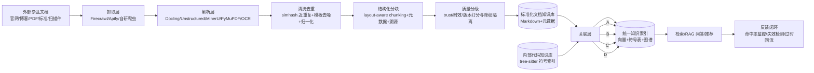

# 外部杂乱文档治理 + 内部代码知识库关联：方法论与最佳实践调研

## 一、问题定义

企业已有的内部代码知识库（函数/类/模块/仓库/API 的符号索引）只覆盖"代码事实"，而大量外部知识（官方文档、技术博客、PDF 规范、行业标准、扫描件）散落且质量参差，存在三类"杂乱"：**来源杂**（官网/博客/PDF/标准各有各的格式、风格与所有权）、**格式杂**（HTML/PDF/docx/扫描件/表格混排）、**质量杂**（重复转载、版本过时、内容错误、广告导航噪音）。治理的目的不是把文档"收进来"，而是把它变成**可被代码知识库引用、可溯源、可持续更新**的结构化知识资产，最终服务于"搜得到、信得过、对得上代码"三个目标。

## 二、分阶段的治理流程（Ingestion & Curation）

| 阶段 | 核心任务 | 推荐工具 | 注意点 |
|---|---|---|---|
| ① 抓取 | 按站点配置策略与频率批量采集官网/博客/规范 | Firecrawl（网页抓取/搜索 API，直接输出 LLM 友好文本）[4]、Apify（预置大量站点爬虫 actor）、自研爬虫（登录墙/反爬站点） | robots.txt 与抓取频率合规；区分全站抓取与按需抓取；保存原始 HTML 快照供溯源与重解析 |
| ② 解析 | 把 HTML/PDF/docx/扫描件统一转为结构化文本 | Docling（IBM 开源，PDF/Word/PPT/HTML → Markdown/JSON，layout-aware）[1]、Unstructured（partition→chunk→embed 的文档 ETL）[2]、MinerU（复杂 PDF/Office → LLM-ready 格式，含版面分析）[3]、PyMuPDF（轻量 PDF 抽取）、扫描件先过 OCR（如 PaddleOCR） | 表格、公式、双栏 PDF、页眉页脚是重灾区；务必抽样校验解析结果而非盲信 |
| ③ 清洗去重 | 去广告/导航/模板噪音；近重复检测；规范化 | minhash/simhash 近重复检测、正则模板去噪、LLM 摘要归一化 | 同一文章多版本转载必须去重，否则污染检索 Top-K；官方原文与转载并存时保留官方源并记录别名 |
| ④ 结构化分块 | 语义分块（依标题层级/表格边界切分），补元数据，留溯源 | LangChain/LlamaIndex 分块器、Docling 的 layout-aware 分块[1] | 分块粒度应与代码实体粒度（函数级/API 级）对齐，这是后续关联的前提；每个 chunk 必须携带 source_url、抓取时间、内容 sha 指纹 |
| ⑤ 质量分级 | 可信度/时效性/版本打分，低质文档隔离 | LLM 打分（站点权威性+内容质量）、规则打分（发布日期、版本号、维护状态）、人工抽检 | 建立元数据字段：`trust_level`、`valid_from/to`、`version`、`status(draft\|deprecated)`；过期文档按"降权"而非"删除"处理，保留变更历史 |

**要点**：治理不是一次性工程，而是带反馈的持续管道——检索命中率低、问答答非所问、引用过期版本，都应回流到清洗与分块策略调整（见第六节闭环设计）。多份 2026 年对比评测的共识是：解析质量是 RAG 效果的第一决定因素，Docling/Unstructured/LlamaParse 等工具的选型应基于自测数据而非宣传[15]。

## 三、关联机制：四条路线对比

| 路线 | 实现方式 | 优点 | 缺点 | 适用场景 |
|---|---|---|---|---|
| **A. 语义嵌入 + 向量检索** | 文档与代码分别向量化后进统一向量库，dense 语义检索；可叠加 BM25 构成混合检索（hybrid）并重排 | 实现成本最低、见效快、零标注；对"语义相近但用词不同"的匹配有效 | 代码与自然语言语义空间差异大，纯通用 embedding 对齐效果一般[18]；检索结果不可解释、难审计 | 起步期、知识规模中等、对召回精度要求不苛刻的场景 |
| **B. 实体级链接（Entity Linking）** | 用 tree-sitter 增量解析提取代码符号（函数/类/API 签名）[5]，与文档中的标识符/术语做精确匹配和对齐 | 精确、可解释、零幻觉；映射关系可审计可回归测试 | 强依赖命名一致性，文档用别名/缩写/图示替代时就失效；覆盖有限 | 对外部 API 手册、SDK 文档等标识符密集的文档效果最好，是官方文档关联的首选 |
| **C. 知识图谱** | 代码实体图 + 文档概念图统一入库（Neo4j/FalkorDB），以边表达"引用/实现/规范"关系 | 支持多跳推理（"哪个模块依赖这份规范"）、可视化、可随代码变更演化[8][13] | 建图与更新维护成本高；知识规模小时收益不明显 | 大型 monorepo、多系统依赖关系复杂的场景；微软 GraphRAG 验证了图结构可提升多跳问答效果[7] |
| **D. LLM 辅助关联** | LLM 生成代码/API 摘要、对齐文档段落与代码实体、自动标注映射并产出置信度 | 灵活，能处理别名、缩写与口语化表述；可批量处理存量文档 | 有幻觉风险，必须人工/规则抽样校验；token 成本随规模线性增长 | 作为其他路线的后处理补位层，或对存量文档做一次性批量标注 |

**选型建议**：B 打底（标识符精确匹配、零幻觉）+ A 兜底（语义召回覆盖别名与概念级匹配）+ D 校验补标（处理新旧版本差异与命名漂移），规模与多跳需求明确后再演进到 C。

Embedding 选型方面，代码侧应优先代码预训练模型，如 CodeBERT/UniXcoder[6] 以及各类代码专用 embedding[16]。

通用 embedding 与代码专用模型混用是常见误区，代码与技术文档的向量化需分开评估[14][18]。

## 四、端到端架构模式

```
外部文档 → 治理管道(抓取→解析→清洗→分块→质检) → 标准化文档知识库
                                                        ↓
内部代码知识库(tree-sitter 符号索引/仓库元数据) → 关联层(嵌入/实体链接/图谱建边/LLM 标注)
                                                        ↓
                                        统一知识索引(向量 + 符号表 + 图谱边)
                                                        ↓
                                检索 / RAG 问答 / 代码推荐 / 变更影响分析
```

该模式贯穿的实践共识有三：

其一，**docs-as-code**——把治理后的外部文档当作"代码"管理（进 Git、走评审、版本化、可回滚），GitLab Handbook 的整套方法论即以此为核心[10][11]。

其二，**同源同搜**——文档与代码应被同一个检索系统索引，Sourcegraph 的文档体系与代码搜索产品统一维护即是例证[12]。

其三，**图谱化收敛**——企业级统一知识平台（如 Glean）把文档、代码、工单整合进同一知识图谱，让"文档↔代码"的关联成为可查询的一等公民[17]。

## 五、真实案例

1. **GitLab Handbook（docs-as-code 鼻祖）**：全员手册托管在代码仓库中，文档随代码走 MR 评审、版本化发布；并公开维护"Handbook Development"文档说明治理规范与工具链[10][11]。**借鉴**：治理后的文档与内部代码库同仓同流程，天然获得"关联"与"更新"机制。
2. **Sourcegraph**：以代码搜索为核心产品，自身文档全部开源并纳入统一搜索体系，文档与代码可交叉定位，验证了"代码+文档统一检索"的可行性[12]。**借鉴**：检索层应同时索引代码符号空间与文档知识空间，而非建两套割裂的系统。
3. **code-graph-rag（开源 monorepo 知识图谱 RAG）**：用知识图谱对 monorepo 建索引，将代码与文档统一为图节点供 LLM 问答[9]；同类实践包括 CodeGraph（预索引代码知识图谱，随代码变更自动同步）[8] 与 FalkorDB 的工程实践博客[13]。**借鉴**：图谱路线的最小可运行参考实现，可直接对照落地。
4. **Glean（企业级商业化实践）**：将文档、代码、内部 wiki、工单统一索引为知识图谱并提供 AI 搜索与助手，是"文档+代码关联"的规模化验证[17]。**借鉴**：关联层的最终形态是统一实体图谱 + 统一检索入口。

## 六、【治理 + 关联】完整流水线推荐架构



**数据流说明**：外部文档经五阶段治理管道进入标准化文档知识库（带完整元数据与溯源）；内部代码知识库持续产出符号级索引；关联层以"B 实体链接为主 + A 混合检索兜底 + D LLM 校验补标"的方式生成文档 chunk ↔ 代码实体的映射，写入统一知识索引；消费端（检索/RAG 问答/推荐）产生的命中率、失效引用、版本漂移信息回流到治理与关联层，形成闭环。

**落地节奏建议**：
- **第 1 阶段（1–2 周）**：跑通抓取+解析+清洗管道，用 Docling/Unstructured/MinerU 覆盖主流格式[1][2][3]，产出带溯源的标准文档库；
- **第 2 阶段**：tree-sitter 建立代码符号索引[5]，实体链接（路线 B）与混合检索（路线 A）双轨并行，产出第一版"文档↔代码"映射表；
- **第 3 阶段**：LLM 标注员（路线 D）批量校验与补标，建立"文档版本 ↔ 代码版本"对齐关系，纳入 CI 做回归校验；
- **第 4 阶段**：多跳查询需求明确后引入知识图谱（路线 C），叠加反馈闭环（检索效果监控、失效链接检测、自动触发重抓取）持续驱动治理管道迭代[7][9]。

## Sources

[1] https://github.com/docling-project/docling — Docling (IBM): 文档解析为 gen AI
[2] https://github.com/Unstructured-IO/unstructured — Unstructured: 文档 ETL
[3] https://github.com/opendatalab/MinerU — MinerU: PDF/Office 转为 LLM-ready 格式
[4] https://github.com/firecrawl/firecrawl — Firecrawl: 网页抓取上下文 API
[5] https://github.com/tree-sitter/tree-sitter — tree-sitter: 增量解析系统
[6] https://github.com/microsoft/CodeBERT — CodeBERT/UniXcoder: 代码预训练模型
[7] https://github.com/microsoft/graphrag — GraphRAG: 图基 RAG
[8] https://github.com/colbymchenry/codegraph — CodeGraph: 预索引代码知识图谱
[9] https://github.com/vitali87/code-graph-rag — code-graph-rag: monorepo 知识图谱 RAG
[10] https://handbook.gitlab.com/docs/development — GitLab Handbook Development
[11] https://about.gitlab.com/blog/five-fast-facts-about-docs-as-code-at-gitlab — GitLab docs-as-code 五事实
[12] https://sourcegraph.com/docs — Sourcegraph 文档
[13] https://www.falkordb.com/blog/code-graph — FalkorDB: 从代码构建可查询知识图谱
[14] https://zilliz.com/ai-faq/what-embedding-models-work-best-for-code-and-technical-content — Zilliz: 代码与技术内容的最佳 embedding
[15] https://dreaming.press/posts/2026-06-21-docling-vs-unstructured-vs-llamaparse.html — Docling vs Unstructured vs LlamaParse 对比
[16] https://modal.com/blog/6-best-code-embedding-models-compared — Modal: 6 种代码 embedding 模型对比
[17] https://www.glean.com — Glean: 企业统一搜索(文档+代码)
[18] https://zilliz.com/ai-faq/how-do-specialized-code-embeddings-like-codebert-differ-from-general-models — Zilliz: 代码专用 embedding vs 通用模型
